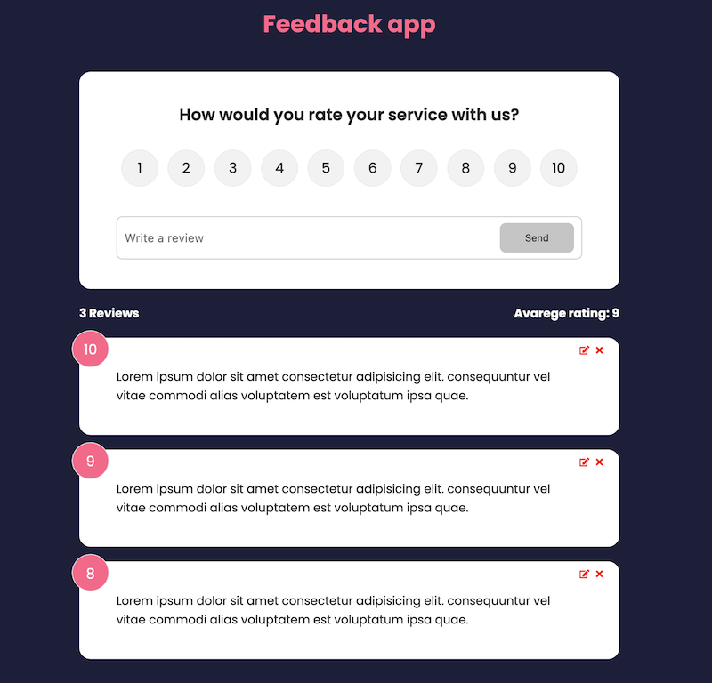

# React feedback app with JSON server

# Created at

March 31, 2022

# Project is created with

- React
- JSON
- CSS

# View on browser

## [https://admirable-cupcake-20d338.netlify.app/](https://admirable-cupcake-20d338.netlify.app/)

# View as image

# Getting Started with Create React App

This project was bootstrapped with [Create React App](https://github.com/facebook/create-react-app).

## Available Scripts

In the project directory, you can run:

### `npm i`

Install the dependencies in the local node_modules folder.

### `npm run dev`

Runs the app in the development mode.\
Open [http://localhost:3000](http://localhost:3000) to view it in your browser.
Open [http://localhost:5000](http://localhost:5000/feedback) to view JSON database in your browser.
